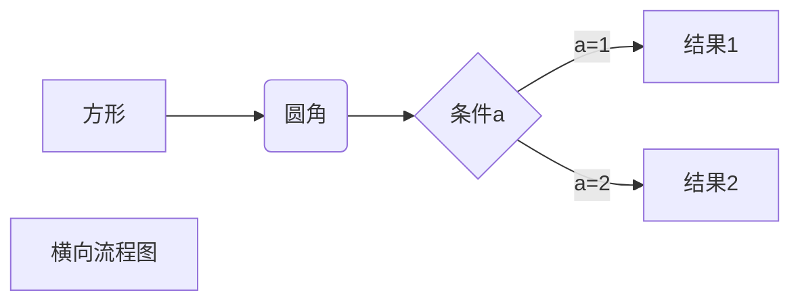
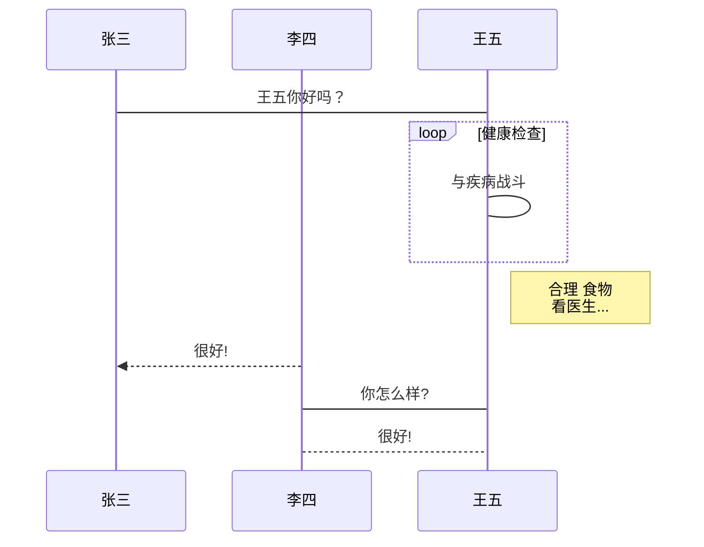
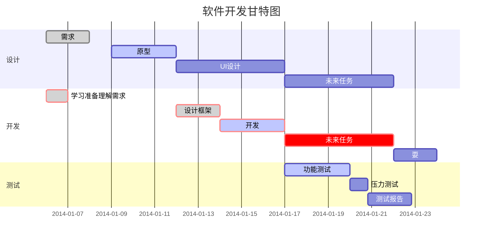

# 引言:

> Markdown 是一种轻量级标记语言，它允许人们使用易读易写的纯文本格式编写文档。
> Markdown 语言在 2004 由约翰·格鲁伯（英语：John Gruber）创建。
> Markdown 编写的文档可以导出 HTML 、Word、图像、PDF、Epub 等多种格式的文档。
> Markdown 编写的文档后缀为 **.md**, **.markdown**。


## Markdown 应用

Markdown 能被使用来撰写电子书，如：Gitbook。

当前许多网站都广泛使用 Markdown 来撰写帮助文档或是用于论坛上发表消息。例如：GitHub、简书、reddit、Diaspora、Stack Exchange、OpenStreetMap 、SourceForge等。

## 编辑器

本教程将使用 Typora 编辑器来讲解 Markdown 的语法，Typora 支持 MacOS 、Windows、Linux 平台，且包含多种主题，编辑后直接渲染出效果。

支持导出HTML、PDF、Word、图片等多种类型文件。

Typora 官网

~~~java
https://typora.io
~~~


# Markdown 标题

Markdown 标题有两种格式。

### 1、使用 = 和 - 标记一级和二级标题

= 和 - 标记语法格式如下：

```markdown
我展示的是一级标题
=================

我展示的是二级标题
-----------------
```

显示效果如下图：


### 使用 # 号标记

使用 **#** 号可表示 1-6 级标题，一级标题对应一个 **#** 号，二级标题对应两个 **#** 号，以此类推。

```markdown
# 一级标题
## 二级标题
### 三级标题
#### 四级标题
##### 五级标题
###### 六级标题
```

显示效果如下图：


# Markdown 段落

Markdown 段落没有特殊的格式，直接编写文字就好，**段落的换行是使用两个以上空格加上回车**。


当然也可以在段落后面使用一个空行来表示重新开始一个段落。


------

## 字体

Markdown 可以使用以下几种字体：

```markdown
*斜体文本*
_斜体文本_
**粗体文本**
__粗体文本__
***粗斜体文本***
___粗斜体文本___
```

显示效果如下所示：


------

## 分隔线

你可以在一行中用三个以上的星号、减号、底线来建立一个分隔线，行内不能有其他东西。你也可以在星号或是减号中间插入空格。下面每种写法都可以建立分隔线：

```markdown
***

* * *

*****

- - -

----------
```

显示效果如下所示：


------

## 删除线

如果段落上的文字要添加删除线，只需要在文字的两端加上两个波浪线 **~~** 即可，实例如下：

```markdown
RUNOOB.COM
GOOGLE.COM
~~BAIDU.COM~~
```

显示效果如下所示：


------

## 下划线

下划线可以通过 HTML 的 **** 标签来实现：

```markdown
<u>带下划线文本</u>
```

显示效果如下所示：


------

# 块元素（Block Elements）

##  段落和行结束（Paragraph and line breaks）

大多数 markdown 解析器忽略单行分隔符，为了上其他 markdown 解析器识别行分隔符，可以在末尾使用两个空格，或者插入 </br>

## 引用（Blockquotes）

使用 > 字符，表示引用

```markdown
> This is a blockquote with two paragraphs. This is first paragraph.
>
> This is second pragraph.Vestibulum enim wisi, viverra nec, fringilla in, laoreet vitae, risus.


> This is another blockquote with one paragraph. There is three empty line to seperate two blockquote.
```

> This is a blockquote with two paragraphs. This is first paragraph.
>
> This is second pragraph.Vestibulum enim wisi, viverra nec, fringilla in, laoreet vitae, risus.
>  This is another blockquote with one paragraph. There is three empty line to seperate two blockquote.

## 列表（Lists）

输入 * 将会创建一个无序列表，也可以使用 + 或者 -

```markdown
* Red
* Green
* Blue
```

* Red
* Green
* Blue

输入 1. 将会创建有序列表

```markdown
1.  Red
2.  Green
3.  Blue
```

1. Red
2. Green
3. Blue

##  任务列表（Task List）

用 [ ] 或者 [X] 未完成，完成）表示列表，通过点击复选框来更改状态（完成/未完成）

```markdown
- [ ] a task list item
- [ ] list syntax required
- [ ] normal **formatting**, @mentions, #1234 refs
- [ ] incomplete
- [x] completed
```


1.5任务列表.png

##代码块（Code Blocks）

使用 ``` <语言> 按回车键，将会对代码进行高亮

~~~markdown
```ruby
require 'redcarpet'
markdown = Redcarpet.new("Hello World!")
puts markdown.to_html
```
~~~

```ruby
require 'redcarpet'
markdown = Redcarpet.new("Hello World!")
puts markdown.to_html
```

## 数学（Math Blocks）

可以使用MathJax呈现LaTeX数学表达式。

```markdown
$$
\mathbf{V}_1 \times \mathbf{V}_2 =  \begin{vmatrix} 
\mathbf{i} & \mathbf{j} & \mathbf{k} \\
\frac{\partial X}{\partial u} &  \frac{\partial Y}{\partial u} & 0 \\
\frac{\partial X}{\partial v} &  \frac{\partial Y}{\partial v} & 0 \\
\end{vmatrix}
$$
```


## 表格（Tables）

使用 | First Header | Second Header | 按回车键，将会创建2列的表格

```markdown
| First Header  | Second Header |
| ------------- | ------------- |
| Content Cell  | Content Cell  |
| Content Cell  | Content Cell  |
```

| First Header | Second Header |
| ------------ | ------------- |
| Content Cell | Content Cell  |
| Content Cell | Content Cell  |

还可以使用 : 号，来设置文字对齐方式

```markdown
| Left-Aligned  | Center Aligned  | Right Aligned |
| :------------ |:---------------:| -----:|
| col 3 is      | some wordy text | $1600 |
| col 2 is      | centered        |   $12 |
| zebra stripes | are neat        |    $1 |
```

| Left-Aligned  | Center Aligned  | Right Aligned |
| :------------ | :-------------: | ------------: |
| col 3 is      | some wordy text |         $1600 |
| col 2 is      |    centered     |           $12 |
| zebra stripes |    are neat     |            $1 |

##  脚注（Footnotes）

```csharp
使用 [^footnote] 创建脚注.
[^footnote]: Here is the *text* of the **footnote**.
然后，可以把鼠标停留在脚注中，查看内容
```

You can create footnotes like this[[1\]](#fn1).

```csharp
生产环境，可以像这样使用
You can create footnotes like this[^1].
[^1]: Here is the *text* of the **footnote**.
```

You can create footnotes like this[[2\]](#fn2).

##  横线（Horizontal Rules）

输入 *** 或者 --- 后，按回车键

```markdown
---
```

------

## 目录（Table of Contents -- TOC）

输入 [toc] ，按回车键


1.11目录.png

------

# Span 元素（Span Elements）

## 链接（Links）

文字描述包含在 [] 内，链接地址包含在 () 内，() 要紧接着 [] 后面

```markdown
This is [an example](http://example.com/ "Title") inline link.
[This link](http://example.net/) has no title attribute.
```

This is [an example](http://example.com/) inline link.

[This link](http://example.net/) has no title attribute.

### 引用链接（Reference Links）

引用链接样式，使用两个 []

```markdown
This is [an example][id] reference-style link.

Then, anywhere in the document, you define your link label like this, on a line by itself:

[id]: http://example.com/  "Optional Title Here"
```

This is [an example](http://example.com/) reference-style link.
 Then, anywhere in the document, you define your link label like this, on a line by itself:

Type 简化了使用方法，如下

```markdown
[Bing][]
And then define the link:

[Bing]: http://bing.com/
```

[Bing](http://bing.com/)
 And then define the link:

## 图片（Images）

在链接格式前面添加 ! ，如下

```markdown

```


timg.jpg

##强调（Emphasis）

对应 HTML 的 <em> 标签

```markdown
*single asterisks*

_single underscores_
```

*single asterisks*
 *single underscores*

如果像使用 * 号，在 * 号前使用 \

```kotlin
\*this text is surrounded by literal asterisks\*
```

*this text is surrounded by literal asterisks*

## 加粗（Strong）

```markdown
**double asterisks**

__double underscores__
```

**double asterisks**
 **double underscores**

##  代码（Code）

在文章中现实代码，用 ` 号表示

```markdown
Use the `printf()` function.
```

Use the `printf()` function.

## Emoji 表情（Emoji

用两个 : 号包含单词，或者在 编辑 -> 表情与符号 中选择

```css
:happy:
```


:happy:

## 内联数学（Inline Math）

这个功能默认是关闭的，如果要打开这个功能（以 Mac 版本为例），选择 Typora -> 偏好设置 -> markdown 标签，勾选内联公式复选框

```ruby
$\lim_{x \to \infty} \exp(-x) = 0$
```

下面是简书风格，typora 与之类似
 %20%3D%200)

## 下表（subscript）

这个功能默认是关闭的，如果要打开这个功能（以 Mac 版本为例），选择 Typora -> 偏好设置 -> markdown 标签，勾选下标复选框

```undefined
H~2~O
```

##  上标（Superscript）

这个功能默认是关闭的，如果要打开这个功能（以 Mac 版本为例），选择 Typora -> 偏好设置 -> markdown 标签，勾选上标复选框

```undefined
X^2^
```

## 高亮（Highlight）

这个功能默认是关闭的，如果要打开这个功能（以 Mac 版本为例），选择 Typora -> 偏好设置 -> markdown 标签，勾选高亮复选框

```undefined
==highlight==
```


------

# HTML

可以使用 HTML 样式来写 Markdown，比如

```kotlin
<span style="color:red">this text is red</span>
```


##  嵌入内容（Embed Contents）

```xml
<iframe height='265' scrolling='no' title='Fancy Animated SVG Menu' 
src='http://codepen.io/jeangontijo/embed/OxVywj/?height=265&theme-id=0&default-tab=css,result&embed-version=2' 
frameborder='no' allowtransparency='true' allowfullscreen='true' 
style='width: 100%;'></iframe>
```


## 视频（Video）

```xml
<video src="xxx.mp4" />
```

# Markdown 列表

Markdown 支持有序列表和无序列表。

无序列表使用星号(*****)、加号(**+**)或是减号(**-**)作为列表标记：

```markdown
* 第一项
* 第二项
* 第三项

+ 第一项
+ 第二项
+ 第三项


- 第一项
- 第二项
- 第三项
```

显示结果如下：


有序列表使用数字并加上 **.** 号来表示，如：

```markdown
1. 第一项
2. 第二项
3. 第三项
```

显示结果如下：


### 列表嵌套

列表嵌套只需在子列表中的选项添加四个空格即可：

```markdown
1. 第一项：
    - 第一项嵌套的第一个元素
    - 第一项嵌套的第二个元素
2. 第二项：
    - 第二项嵌套的第一个元素
    - 第二项嵌套的第二个元素
```

显示结果如下：


# Markdown 区块

Markdown 区块引用是在段落开头使用 **>** 符号 ，然后后面紧跟一个**空格**符号：

```markdown
> 区块引用
> 框架师
> 代码改变世界
```

显示结果如下：


另外区块是可以嵌套的，一个 **>** 符号是最外层，两个 **>** 符号是第一层嵌套，以此类推退：

```markdown
> 最外层
> > 第一层嵌套
> > > 第二层嵌套
```

显示结果如下：


### 区块中使用列表

区块中使用列表实例如下：

```markdown
> 区块中使用列表
> 1. 第一项
> 2. 第二项
> + 第一项
> + 第二项
> + 第三项
```

显示结果如下：


### 列表中使用区块

如果要在列表项目内放进区块，那么就需要在 **>** 前添加四个空格的缩进。

区块中使用列表实例如下：

```markdown
* 第一项
    > 框架师
    > 代码改变世界
* 第二项
```

显示结果如下：

* 第一项

> 框架师
>
> 代码改变世界

* 第二项

# Markdown 代码

如果是段落上的一个函数或片段的代码可以用反引号把它包起来（**`**），例如：

```markdown
`printf()` 函数
```

显示结果如下：


### 代码区块

代码区块使用 **4 个空格**或者一个**制表符（Tab 键）**。

实例如下：


显示结果如下：


你也可以用 **```** 包裹一段代码，并指定一种语言（也可以不指定）：

~~~markdown
```javascript
$(document).ready(function () {
    alert('RUNOOB');
});
```
~~~

显示结果如下：


# Markdown 链接

链接使用方法如下：

```markdown
[链接名称](链接地址)

或者

<链接地址>
```

例如：

```markdown
这是一个链接 [框架师](https://mobaijun8.cn)
```

显示结果如下：

这是一个链接 [框架师](https://mobaijun8.cn)


直接使用链接地址：

```markdown
<https://mobaijun8.cn>
```

显示结果如下：

https://mobaijun8.cn

# Markdown 图片

Markdown 图片语法格式如下：

```markdown


```

* 开头一个感叹号 !
* 接着一个方括号，里面放上图片的替代文字
* 接着一个普通括号，里面放上图片的网址，最后还可以用引号包住并加上选择性的 'title' 属性的文字。

使用实例：

```markdown


```

显示结果如下：


Markdown 还没有办法指定图片的高度与宽度，如果你需要的话，你可以使用普通的  标签。

```markdown

```

显示结果如下：


# Markdown 表格

Markdown 制作表格使用 **|** 来分隔不同的单元格，使用 **-** 来分隔表头和其他行。

语法格式如下：

```markdown
|  表头   | 表头  |
|  ----  | ----  |
| 单元格  | 单元格 |
| 单元格  | 单元格 |
```

以上代码显示结果如下：


对齐方式

**我们可以设置表格的对齐方式：**

* **-:** 设置内容和标题栏居右对齐。
* **:-** 设置内容和标题栏居左对齐。
* **:-:** 设置内容和标题栏居中对齐。

实例如下：

```markdown
| 左对齐 | 右对齐 | 居中对齐 |
| :-----| ----: | :----: |
| 单元格 | 单元格 | 单元格 |
| 单元格 | 单元格 | 单元格 |
```

以上代码显示结果如下：


# Markdown 高级技巧

### 支持的 HTML 元素

不在 Markdown 涵盖范围之内的标签，都可以直接在文档里面用 HTML 撰写。

目前支持的 HTML 元素有：`       `等 ，如：

```markdown
使用 <kbd>Ctrl</kbd>+<kbd>Alt</kbd>+<kbd>Del</kbd> 重启电脑
```

输出结果为：


### 转义

Markdown 使用了很多特殊符号来表示特定的意义，如果需要显示特定的符号则需要使用转义字符，Markdown 使用反斜杠转义特殊字符：

```markdown
**文本加粗** 
\*\* 正常显示星号 \*\*
```

输出结果为：


Markdown 支持以下这些符号前面加上反斜杠来帮助插入普通的符号：

```markdown
\   反斜线
`   反引号
*   星号
_   下划线
{}  花括号
[]  方括号
()  小括号
#   井字号
+   加号
-   减号
.   英文句点
!   感叹号
```

### 公式

当你需要在编辑器中插入数学公式时，可以使用两个美元符 $$ 包裹 TeX 或 LaTeX 格式的数学公式来实现。提交后，问答和文章页会根据需要加载 Mathjax 对数学公式进行渲染。如：

```markdown
$$
\mathbf{V}_1 \times \mathbf{V}_2 =  \begin{vmatrix} 
\mathbf{i} & \mathbf{j} & \mathbf{k} \\
\frac{\partial X}{\partial u} &  \frac{\partial Y}{\partial u} & 0 \\
\frac{\partial X}{\partial v} &  \frac{\partial Y}{\partial v} & 0 \\
\end{vmatrix}
$$tep1}{\style{visibility:hidden}{(x+1)(x+1)}}
$$
```

输出结果为：


### typora 画流程图、时序图(顺序图)、甘特图

复制以下代码使用 typora 的源码模式粘贴到编辑器中查看效果：


以下几个实例效果图如下：

**1、横向流程图源码格式：**

~~~markdown

~~~

**2、竖向流程图源码格式：**

```
​```mermaid
graph TD
A[方形] --> B(圆角)
    B --> C{条件a}
    C --> |a=1| D[结果1]
    C --> |a=2| E[结果2]
    F[竖向流程图]
​```
```

**3、标准流程图源码格式：**

~~~markdown
```flow
st=>start: 开始框
op=>operation: 处理框
cond=>condition: 判断框(是或否?)
sub1=>subroutine: 子流程
io=>inputoutput: 输入输出框
e=>end: 结束框
st->op->cond
cond(yes)->io->e
cond(no)->sub1(right)->op
```
~~~

**4、标准流程图源码格式（横向）：**

~~~markdown
```flow
st=>start: 开始框
op=>operation: 处理框
cond=>condition: 判断框(是或否?)
sub1=>subroutine: 子流程
io=>inputoutput: 输入输出框
e=>end: 结束框
st(right)->op(right)->cond
cond(yes)->io(bottom)->e
cond(no)->sub1(right)->op
```
~~~

**5、UML时序图源码样例：**

~~~markdown
```sequence
对象A->对象B: 对象B你好吗?（请求）
Note right of 对象B: 对象B的描述
Note left of 对象A: 对象A的描述(提示)
对象B-->对象A: 我很好(响应)
对象A->对象B: 你真的好吗？
```
~~~

**6、UML时序图源码复杂样例：**

~~~markdown
```sequence
Title: 标题：复杂使用
对象A->对象B: 对象B你好吗?（请求）
Note right of 对象B: 对象B的描述
Note left of 对象A: 对象A的描述(提示)
对象B-->对象A: 我很好(响应)
对象B->小三: 你好吗
小三-->>对象A: 对象B找我了
对象A->对象B: 你真的好吗？
Note over 小三,对象B: 我们是朋友
participant C
Note right of C: 没人陪我玩
```
~~~

**7、UML标准时序图样例：**

~~~markdown

~~~

**8、甘特图样例：**

~~~markdown

~~~

效果图如下：


# 附录

> ### 备注：部分参考菜鸟教程
>
> ### [Typora 官方文档](https://support.typora.io)


持续更新中...，如果遇到问题欢迎联系我，在文章最后评论区【留言和讨论】，当然，欢迎点击文章最后的打赏按键，请墨白喝一杯冰阔乐，笑～**

<escspe>

<table>
    <tr>
        <td></td>
        <td></td>
        <td></td>
    </tr>
</table>

<escape>

